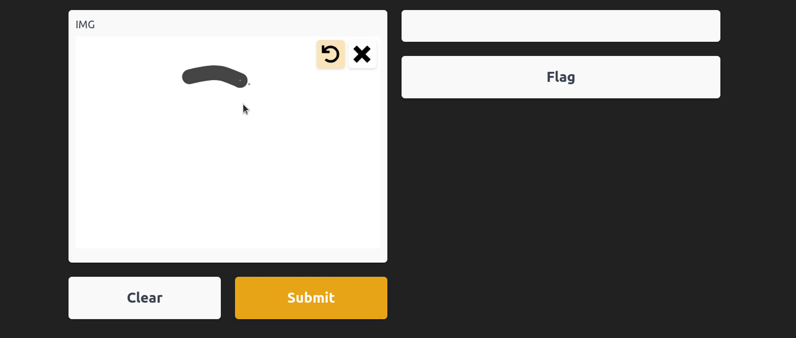

# MNIST_FastAI
This is one of the most popular and basic competitions from kaggle which is called MNIST digit recognition written using the FastAI library. 
I was surprised by how simple and powerful it is. 
With just a few lines of code, I reached 99.5 % on the leaderboard

I highly recommend taking FastAI the course because it focuses more on practice and it will fill any gaps you didn't remember or didn't study.

In addition, I created a visualization of the model using Gradio. 
Gradio is a tool for visualizing demos that is very straightforward and simple to use for this type of thing

- [FastAI course](https://course.fast.ai/videos/?lesson=1)
- [Kaggle competition](https://www.kaggle.com/c/digit-recognizer)

